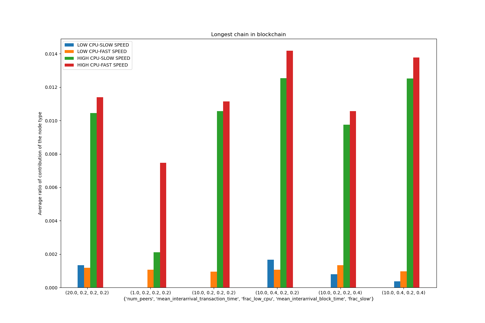

# P2P-Cryptocurrency-Network-Simulator

CS765 Assignment  to build a discrete event simulator for Peer-to-Peer Cryptocurrency Network

## Running the Simulator

To run the simulator with default arguments, use blockSim
The following is the help of the same to change the parameters.

```bash
-$ ./blockSim
Usage: blockSim [OPTION...]

  -t, --interarrival_transaction_time=float
                             inter arrival time between transactions
  -k, --interarrival_block_time=float
                             mean interarrival block time
  -b, --max_blocks=int       number of blocks to terminate
  -a, --initial_amt=int      initial coins for each node
  -i, --frac_slow=float      fraction of slow(slow on network,  high latency)
                             nodes
  -s, --seed=int             for randomness in simultaion
  -x, --max_transactions=int Number of Transactions for stopping criteria
  -g, --graph=file_path      path of graph file generated by python
  -z, --g1=float             hashing power of selfish miner 1
  -y, --g2=float             hashing power of selfish miner 2
  -?, --help                 Give this help list
      --usage                Give a short usage message
```

### Running in docker environment

To run the simulator in docker environment, build the image and run the containers using the following commands
```bash
docker build . -t <image name>
docker run -ti -v $(pwd):/code <image name>
```

## Results

The results of the simulator are logged in `.log.csv` files in the current directory.

### Log format

File names of logs are appended with params resulting in filenames of format
```
<file_name>_<args.num_peers>_<args.interarrival_block_time>_<args.frac_low_cpu>_<args.interarrival_transaction_time>_<args.frac_slow>.log.csv
```

#### `block_info_<params>.log.csv`

- `id`

    Block ID of the block
- `pid`

    Block ID of parent block
- `create_time`
    
    Time at which the block was created
- `creator`

    Node ID that created the block

The first row corresponds to the genesis block, hence the time is nan and creator and pid are kept -1.


#### `node_info_<params>.log.csv`

- `id`

    Node id
- `is_fast`

    **1**, if node has low network latency
- `is_high_cpu`
    
    **1**, if node is having high hashing power which is 10 times of hashing power of low hashing power nodes

#### `block_recieve_node<nodeID>_<params>.log.csv`

This file has the information of time when blocks are received by node corresponding to `nodeID`
id,cid,pid,pcid
- `id`
    
    BlockID of received block
- `cip`

    CreatorID of received block
- `pid`

    Parent BlockID of received block
- `pcid`

    CreatorID of Parent BlockID

    
    Time of arrival of block at node `nodeID`

## Analysis - Visual Representation of logs

For a complete visual representation, use the file `analysis.py`.

```bash
./analysis.py --help
usage: analysis.py [-h] --logs_dir LOGS_DIR

options:
  -h, --help           show this help message and exit
  --logs_dir LOGS_DIR
```
For using the `full_analysis` option, put current directory containing the `block_info_<params>.log.csv` and `node_info_<params>.log.csv` as arguments. This option can also be used to compare results for different parameters.

`blockchain_tree` option can be used to plot the tree of at most 200 blocks as a graph.

## Sample Results

`sample_logs` directory has the sample results of simulator on various parameter combinations.

The following image shows the comparison of the contribution of blocks in longest chain of different types of nodes.


The following images are sample blockchain trees with high and low forking.


